  <h1>Thomas Montout</h1>
  
<em>Développeur Full-Stack</em>

  

     
  
     
     

  
  

 

## ▌ Profil Professionnel

Développeur passionné par la création de solutions web modernes et performantes. Je construis des architectures robustes (Headless, MVC) et j'intègre des technologies avancées comme l'Intelligence Artificielle (RAG) dans mes projets. Mon objectif : écrire du code propre (Principes SOLID) qui résout de véritables problèmes.

- **État actuel** : Étudiant en BTS Solutions Logicielles et Applications Métiers (SLAM)
- **Alternance** : Apprenti chez COFACE

---

## ▌ Projets Majeurs

[**Absolute Stream**](https://github.com/thomas-montout/Absolute-Stream)
> Plateforme communautaire de gestion et découverte de films et séries — avec plusieurs concepts innovants.

Technologies : **TypeScript**, **Next.js**, **Tailwind** et **NeonDB**.

 

[**V.ROOM**](https://github.com/thomas-montout/V.ROOM)
> Projet BTS : Plateforme e-commerce automobile headless avec assistant de recherche alimenté par l'IA (Claude).

Technologies : **Symfony**, **PostgreSQL**, **React**, **Zustand** et **Tailwind**.

 

[**BOT IAM**](https://github.com/thomas-montout/Bot-IAM)
> Bot Python d’apprentissage basé sur le RAG (Retrieval-Augmented Generation).

Création d'un assistant capable de répondre à des questions à partir de documents IAM. Technologies : **Python**, **FastAPI** et **Next.js**.

---

## ▌ Stack technique

**Langages** 

 

**Frameworks & Bibliothèques** 

 

**Bases de données** 

 

**Outils, OS & Design** 

 

**En apprentissage** 

 

**En maitrise** : POO avancée, Clean Code, Architecture MVC, CI/CD et RAG.

---

## ▌ Statistiques GitHub

  
  

---

<i>Dernière mise à jour : Mai 2026</i>

